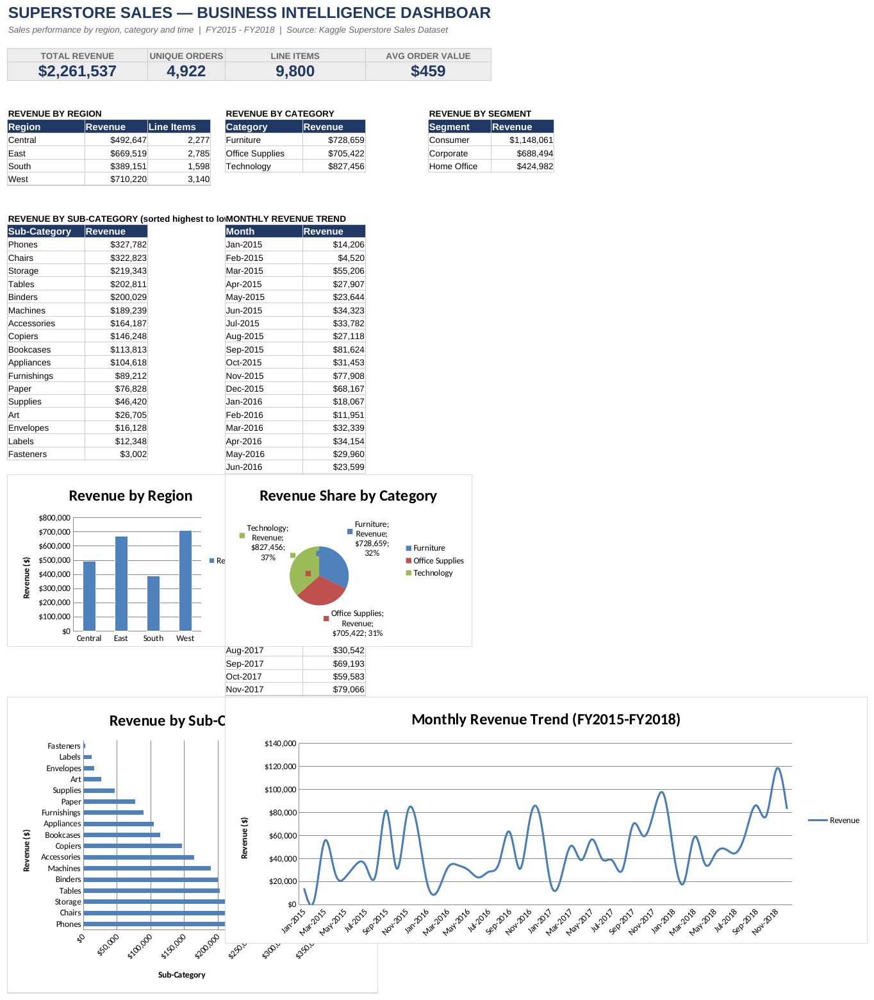
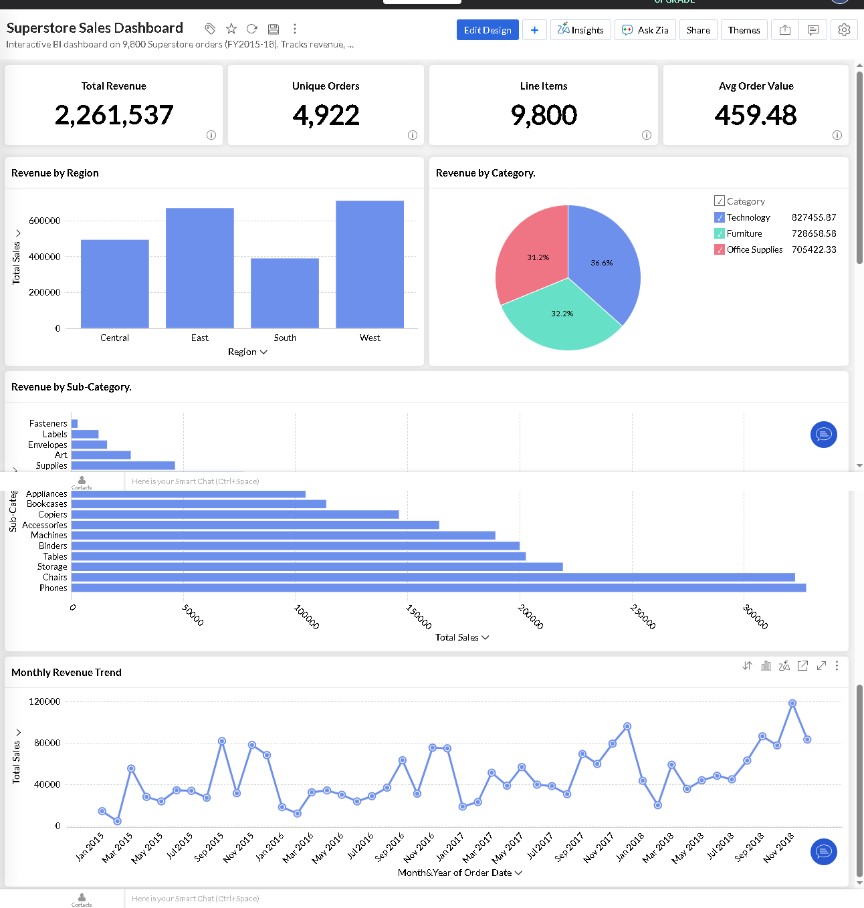

# Business Intelligence Dashboard — Superstore Sales Analysis

## Table of Contents
- [Problem](#problem)
- [Data Source](#data-source)
- [Approach](#approach)
- [Sample Formulas](#Sample-Formulas)
- [Key Insights](#key-insights)
- [Tools Used](#tools-used)
- [Zoho Analytics Dashboard (Companion Build)](#zoho-analytics-dashboard-companion-build)
- [Files](#files)
- [How to View](#how-to-view)
- [Notes](#notes)
- [Recommendations](#recommendations)

Interactive BI dashboard built in **Microsoft Excel** to analyze sales performance across regions, product categories, and time. Built using formula-driven KPIs (SUMIFS/COUNTIFS) and live charts — no hardcoded values, so every number recalculates automatically if the underlying data changes.



## Problem
Analyze 4 years of retail order data to answer: which regions, categories, and customer segments drive the most revenue, and how does revenue trend over time?

## Data Source
[Superstore Sales Dataset](https://www.kaggle.com/datasets/rohitsahoo/sales-forecasting) — Kaggle, 9,800 order line items across 4,922 unique orders, spanning FY2015–FY2018.

## Approach
- Imported and cleaned raw order-level data (converted date fields, added helper columns for month grouping and unique-order detection)
- Built KPI cards for Total Revenue, Unique Orders, Line Items, and Average Order Value using `SUMIFS` / `COUNTIFS` formulas
- Broke down revenue by Region, Category, Segment, and Sub-Category using summary tables
- Built a 48-month revenue trend table to surface seasonality
- Visualized everything with 4 native Excel charts (bar, pie, horizontal bar, line)

## Sample Formulas

A few of the actual formulas driving the dashboard (all pull live from the `Raw Data` sheet — no hardcoded numbers):

```excel
Total Revenue        =SUM('Raw Data'!R2:R9801)
Unique Orders        =SUM('Raw Data'!T2:T9801)
Line Items           =COUNTA('Raw Data'!A2:A9801)
Avg Order Value      =B6/D6
Revenue by Region     =SUMIFS('Raw Data'!$R$2:$R$9801, 'Raw Data'!$M$2:$M$9801, B11)
Revenue by Category   =SUMIFS('Raw Data'!$R$2:$R$9801, 'Raw Data'!$O$2:$O$9801, F11)
Revenue by Sub-Category =SUMIFS('Raw Data'!$R$2:$R$9801, 'Raw Data'!$P$2:$P$9801, B19)
Monthly Revenue Trend =SUMIFS('Raw Data'!$R$2:$R$9801, 'Raw Data'!$S$2:$S$9801, F19)
```

Column reference: `R` = Sales, `M` = Region, `O` = Category, `P` = Sub-Category, `S` = Order Month, `T` = First Order Flag (used to count unique orders).

## Key Insights
- Total revenue across the dataset: **$2,261,536**
- **West** region leads revenue (**$710,220**), followed by East; **South** is lowest
- **Technology** is the top-performing category (**$827,456**), ahead of Furniture and Office Supplies
- **Phones** and **Chairs** are the top two sub-categories by revenue
- **Consumer** segment drives over half of total revenue ($1.15M of $2.26M)

## Tools Used
Microsoft Excel (formulas, PivotTable-style aggregation, native charts), data sourced and cleaned from a public Kaggle dataset.

## Zoho Analytics Dashboard (Companion Build)

To complement the Excel workbook and demonstrate cloud BI tooling, the same dataset and KPIs were rebuilt as an interactive dashboard in Zoho Analytics.



**Live interactive dashboard:** https://analytics.zoho.in/open-view/554171000000007006

Same 4 KPIs (Total Revenue, Unique Orders, Line Items, Avg Order Value) and same 4 charts (Revenue by Region, Revenue by Category, Revenue by Sub-Category, Monthly Revenue Trend), cross-validated to match the Excel workbook's figures exactly.

## How to View

- **Excel dashboard:** download `Superstore_BI_Dashboard.xlsx` and open in Microsoft Excel (best viewed in Excel directly — Google Sheets can distort native Excel chart objects). Open to the "Dashboard" tab to see KPIs and charts; "Raw Data" tab holds the source records.
- **Zoho dashboard:** click the [live interactive link](https://analytics.zoho.in/open-view/554171000000007006) above — no login required, opens directly in your browser.

## Files
- `Superstore_BI_Dashboard.xlsx` — the Excel dashboard (Dashboard tab + Raw Data tab)
- `data/train.csv` — source dataset (Kaggle Superstore Sales)
- `Zoho_Dashboard_Screenshot.png` — preview image of the Zoho Analytics dashboard
- `LICENSE` — MIT License

## Notes
This project uses a widely-used public training dataset for demonstrating BI/dashboard skills (dates reflect the original dataset's 2015–2018 range). Project built: August 2026.

## Recommendations

Based on the revenue breakdown above, three actionable takeaways:

- **Rebalance regional investment.** South trails every other region by a wide margin ($389K vs. West's $710K). Worth investigating whether this is a market-size limitation or an under-invested territory — if the latter, reallocating marketing/sales spend toward South could close part of that gap.
- **Double down on Phones and Chairs.** These two sub-categories alone drive a disproportionate share of revenue. Prioritizing inventory, supplier negotiations, and promotional focus here likely yields more return than spreading effort evenly across all 17 sub-categories.
- **Protect the Consumer segment.** At over half of total revenue, Consumer is the backbone of the business — any retention or loyalty initiative should target this segment first, since even a small drop-off here would outweigh gains in Corporate or Home Office.
